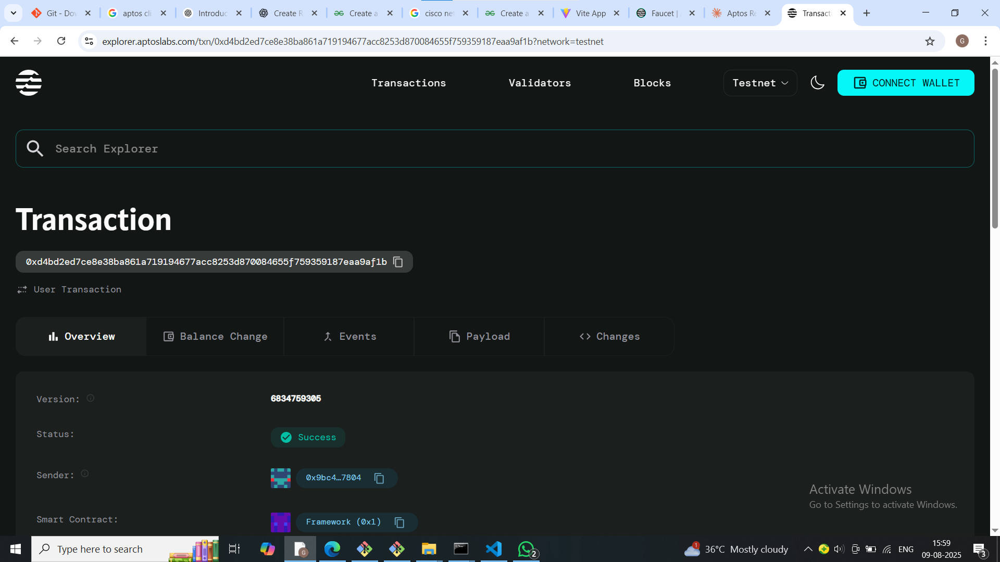

# Real Estate Tokenization

## Project Description

Real Estate Tokenization is a blockchain-based smart contract solution that enables fractional ownership of real estate properties through digital tokens. This innovative approach allows property owners to divide their real estate assets into smaller, tradeable tokens, making real estate investment more accessible to a broader range of investors. By leveraging the Aptos blockchain, the platform provides a secure, transparent, and efficient way to tokenize real estate assets and facilitate fractional ownership investments.

## Project Vision

Our vision is to democratize real estate investment by breaking down traditional barriers to entry in the property market. We aim to create a decentralized ecosystem where:

- **Accessibility**: Small investors can participate in high-value real estate markets with minimal capital requirements
- **Liquidity**: Real estate assets become more liquid through tokenization and fractional trading
- **Transparency**: All transactions and ownership records are immutably stored on the blockchain
- **Global Reach**: Investors worldwide can access diverse real estate opportunities regardless of geographical limitations
- **Efficiency**: Reduced intermediaries and automated processes lower transaction costs and processing times

## Key Features

### 🏠 **Property Tokenization**
- Convert real estate properties into divisible digital tokens
- Set custom token quantities and pricing for each property
- Maintain transparent ownership records on-chain

### 💰 **Fractional Investment**
- Enable investors to purchase property tokens with minimal capital
- Automated payment processing using Aptos Coin (APT)
- Real-time tracking of token sales and availability

### 🔒 **Secure Transactions**
- Built on Aptos blockchain for enhanced security and scalability
- Smart contract validation for all token purchases
- Immutable transaction records

### 📊 **Transparent Ownership**
- Clear visibility into property details and token distribution
- Real-time updates on tokens sold vs. available
- Verifiable property valuation and pricing

### ⚡ **Automated Operations**
- Smart contract handles all token transactions automatically
- No manual intervention required for standard operations
- Built-in validation and error handling

## Future Scope

### Phase 1 - Enhanced Features
- **Token Transfer System**: Allow investors to trade tokens peer-to-peer
- **Dividend Distribution**: Automatic rental income distribution to token holders
- **Multi-Property Portfolios**: Support for multiple properties per owner

### Phase 2 - Advanced Functionality
- **Property Governance**: Token holder voting on property decisions
- **Price Oracle Integration**: Real-time property valuation updates
- **Insurance Integration**: Automated insurance coverage for tokenized properties

### Phase 3 - Ecosystem Expansion
- **Cross-Chain Compatibility**: Expand to other blockchain networks
- **DeFi Integration**: Lending/borrowing against property tokens
- **Mobile Application**: User-friendly mobile interface for investors

### Phase 4 - Market Integration
- **Real Estate Marketplace**: Built-in trading platform for property tokens
- **Professional Services**: Integration with legal, valuation, and property management services
- **Regulatory Compliance**: Enhanced compliance features for different jurisdictions

## Contract Details
0xd4bd2ed7ce8e38ba861a719194677acc8253d870084655f759359187eaa9af1b

